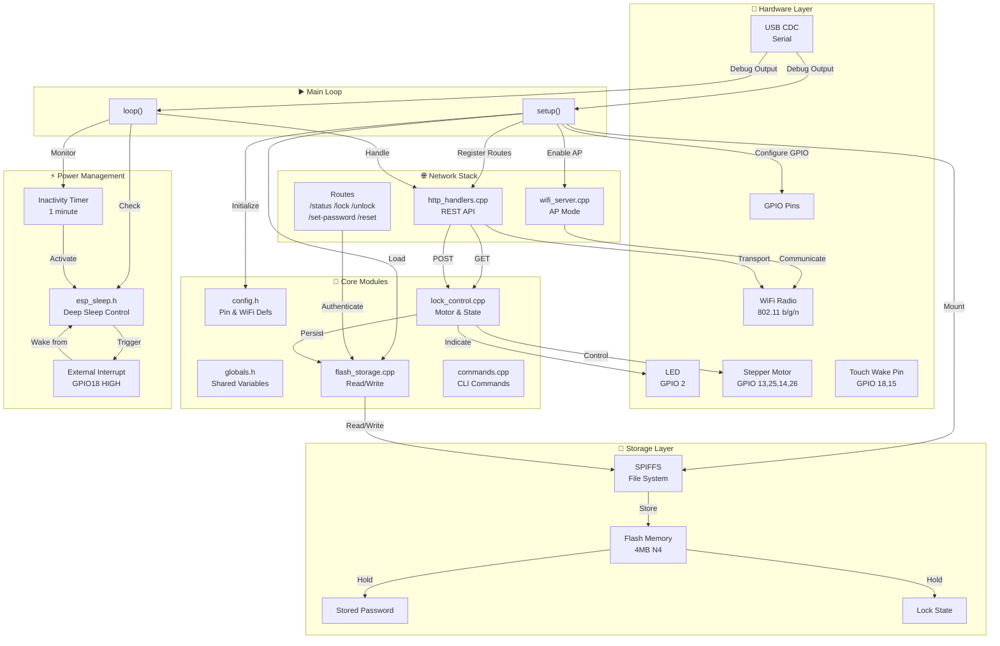
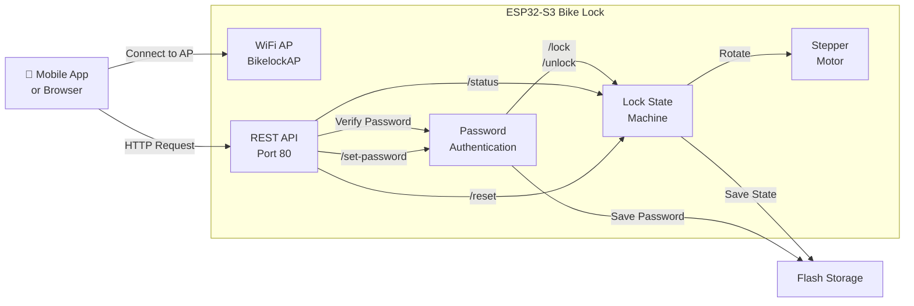

# Smart Bike Lock - Software Architecture

## System Architecture Diagram



## User Interaction Flow



## How to Export These Diagrams

### Option 1: View Online (Easiest)
1. Go to https://mermaid.live
2. Copy the Mermaid code from the code blocks above
3. Paste into the editor
4. Click "Export" → "Download SVG/PNG"

### Option 2: Use VS Code Extension
1. Install "Markdown Preview Mermaid Support" extension
2. Open this file in preview mode (Ctrl+Shift+V)
3. Right-click on diagram → "Save Image As"

### Option 3: Use Command Line (Requires npm)
```bash
npm install -g @mermaid-js/mermaid-cli
mmdc -i ARCHITECTURE.md -o architecture.svg
```

## Architecture Overview

### Hardware Layer
- **LED (GPIO 2)**: Connection indicator
- **Stepper Motor (GPIO 13, 25, 14, 26)**: Physical lock mechanism
- **Wake Pins (GPIO 18, 15)**: External interrupt for deep sleep wakeup
- **USB CDC**: Native serial communication over USB
- **WiFi Radio**: 802.11 b/g/n access point

### Storage Layer
- **SPIFFS**: File-based storage on flash
- **Flash Memory**: 4MB N4 variant (192KB SPIFFS, 1.75MB app code)
- **Stored Password**: Hashed password for authentication
- **Lock State**: Persisted lock status (locked/unlocked)

### Core Modules
- **config.h**: Pin definitions and WiFi configuration constants
- **globals.h**: Shared global variables and extern declarations
- **lock_control.cpp**: Motor control and lock state management
- **flash_storage.cpp**: SPIFFS read/write operations
- **commands.cpp**: CLI command processing

### Network Stack
- **wifi_server.cpp**: Access point (AP) mode initialization
- **http_handlers.cpp**: REST API endpoint handlers
- **Routes**: 5 HTTP endpoints for control and status

### Power Management
- **esp_sleep.h**: Deep sleep configuration
- **Inactivity Timer**: 1 minute of inactivity triggers sleep
- **External Wakeup**: GPIO18 pulled HIGH wakes from sleep

### Main Loop
- **setup()**: Initializes all modules and peripherals
- **loop()**: Handles HTTP requests and monitors inactivity for sleep

## Data Flow

### Lock Operation
```
HTTP Request → Authenticate Password → updateLockState() 
→ Control Stepper Motor → LED Indicator → Save to Flash
```

### Query Status
```
HTTP GET /status → Read Lock State from Memory → Return JSON
```

### Change Password
```
HTTP POST /set-password → Validate → Store Hashed Password → Lock Device
```

### Power Saving
```
Inactivity Detected (1 min) → Disable WiFi → Enter Deep Sleep 
→ GPIO18 HIGH → External Interrupt → Wake & Reinit
```
